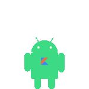
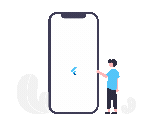
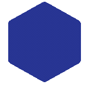

  

<h1 align="center">𝑬𝒙𝒑𝒆𝒓𝒕 𝑴𝒐𝒃𝒊𝒍𝒆 𝑫𝒆𝒗𝒆𝒍𝒐𝒑𝒆𝒓 | 𝑴𝒐𝒃𝒊𝒍𝒆 𝑨𝒓𝒄𝒉𝒊𝒕𝒆𝒄𝒕 | 𝑨𝑰 𝑰𝒏𝒕𝒆𝒈𝒓𝒂𝒕𝒊𝒐𝒏 | 𝑺𝑴𝑴</h1>

<pre>✩░▒▓▆▅▃▂▁👋😀 𝐆𝐫𝐞𝐞𝐭𝐢𝐧𝐠𝐬! 👋😄▁▂▃▅▆▓▒░✩

I am a highly skilled and experienced Mobile App Developer specializing in 𝐂𝐫𝐨𝐬𝐬-𝐏𝐥𝐚𝐭𝐟𝐨𝐫𝐦 development using 𝑭𝒍𝒖𝒕𝒕𝒆𝒓, 𝑹𝒆𝒂𝒄𝒕 𝑵𝒂𝒕𝒊𝒗𝒆 (𝑬𝒙𝒑𝒐 & 𝑪𝑳𝑰), 𝑰𝒐𝒏𝒊𝒄 (𝑹𝒆𝒂𝒄𝒕/𝑽𝒖𝒆.𝒋𝒔/𝑨𝒏𝒈𝒖𝒍𝒂𝒓𝑱𝑺), 𝑿𝒂𝒎𝒂𝒓𝒊𝒏, .𝑵𝑬𝑻 𝑴𝑨𝑼𝑰, and 𝐍𝐚𝐭𝐢𝐯𝐞-𝐏𝐥𝐚𝐭𝐟𝐨𝐫𝐦 development using 𝑺𝒘𝒊𝒇𝒕(SwiftUI/UIKit/Objective-C) for iOS, 𝑲𝒐𝒕𝒍𝒊𝒏, 𝑱𝒂𝒗𝒂 for Android. With a strong focus on delivering exceptional mobile experiences, I have successfully developed and launched numerous applications across various industries. I am dedicated to delivering top-notch work, ensuring high quality, and providing timely updates to my clients.

✌ 𝗠𝘆 𝗦𝗸𝗶𝗹𝗹𝘀 ✌

𝑵𝒂𝒕𝒊𝒗𝒆 𝑷𝒍𝒂𝒕𝒇𝒐𝒓𝒎 𝑫𝒆𝒗𝒆𝒍𝒐𝒑𝒎𝒆𝒏𝒕:
● iOS Development: Swift, SwiftUI, Objective-C, UIKit, CoreData, AutoLayout, Storyboards, Xcode
● Android Development: Kotlin, Java, Android SDK, Jetpack Compose, Android Studio, XML-based layouts
𝑪𝒓𝒐𝒔𝒔-𝑷𝒍𝒂𝒕𝒇𝒐𝒓𝒎 𝑫𝒆𝒗𝒆𝒍𝒐𝒑𝒎𝒆𝒏𝒕
● Flutter: Dart programming language, Flutter Widgets, Cupertino and Material Design, State Management (Provider, Bloc, GetX)
● React Native: JavaScript/TypeScript, Expo & CLI, React Navigation, Redux/MobX, Native Modules integration
● Ionic: Frameworks integration with React, Vue.js, AngularJS, Capacitor, Cordova
● Xamarin / .NET MAUI: C#, Xamarin.Forms, .NET Multi-platform App UI, MVVM pattern, XAML-based UI
𝑩𝒂𝒄𝒌𝒆𝒏𝒅 𝒂𝒏𝒅 𝑨𝑷𝑰 𝑰𝒏𝒕𝒆𝒈𝒓𝒂𝒕𝒊𝒐𝒏
● RESTful API consumption and integration, HTTP protocol management
● JSON parsing and serialization
● XML data handling and parsing
● Authentication and Authorization (OAuth, JWT)
● API testing tools (Postman, Insomnia)
𝑫𝒂𝒕𝒂𝒃𝒂𝒔𝒆 𝒂𝒏𝒅 𝑪𝒍𝒐𝒖𝒅 𝑺𝒕𝒐𝒓𝒂𝒈𝒆
● SQLite database integration and management
● Firebase Realtime Database, Firestore, Firebase Authentication, Cloud Functions
● Local storage and caching mechanisms
● ORM tools for data persistence and management
𝑫𝒆𝒑𝒍𝒐𝒚𝒎𝒆𝒏𝒕 𝒂𝒏𝒅 𝑷𝒖𝒃𝒍𝒊𝒔𝒉𝒊𝒏𝒈
● Apple App Store deployment (TestFlight, App Store Connect, App Review Guidelines)
● Google Play Store deployment (Play Console, Beta testing, Android App Bundles)
● Monitoring and analytics (Firebase Analytics, Crashlytics, App Store Analytics)
𝑷𝒓𝒐𝒇𝒆𝒔𝒔𝒊𝒐𝒏𝒂𝒍 𝑫𝒆𝒗𝒆𝒍𝒐𝒑𝒎𝒆𝒏𝒕 𝑷𝒓𝒂𝒄𝒕𝒊𝒄𝒆𝒔
● Agile methodologies (Scrum, Kanban)
● Code quality and maintainability (SOLID principles, Clean Code)
● Documentation (Technical documentation, API documentation, README preparation)
● Team collaboration and communication (Slack, Jira, Trello, Confluence)

✌ 𝐀𝐝𝐝𝐢𝐭𝐢𝐨𝐧𝐚𝐥 𝐒𝐤𝐢𝐥𝐥𝐬 ✌

𝑰𝒎𝒂𝒈𝒆 𝑮𝒆𝒏𝒆𝒓𝒂𝒕𝒊𝒐𝒏 𝒂𝒏𝒅 𝑪𝒐𝒎𝒑𝒖𝒕𝒆𝒓 𝑽𝒊𝒔𝒊𝒐𝒏 𝑻𝒆𝒄𝒉𝒏𝒐𝒍𝒐𝒈𝒊𝒆𝒔

🌟 Generative Models:
GANs, DeepDream, DALL-E, CLIP, Stable Diffusion
🌟 Frameworks and Libraries:
TensorFlow, PyTorch, Keras, OpenCV, Scikit-image, Caffe2
🌟 Detection and Recognition:
Detectron, YOLO (You Only Look Once), Tesseract OCR (Optical Character Recognition)

𝑪𝒐𝒏𝒗𝒆𝒓𝒔𝒂𝒕𝒊𝒐𝒏𝒂𝒍 𝑨𝑰 & 𝑪𝒂𝒍𝒍𝒊𝒏𝒈 𝑨𝒈𝒆𝒏𝒕 𝑻𝒆𝒄𝒉𝒏𝒐𝒍𝒐𝒈𝒊𝒆𝒔

🌟 Core Speech Technologies:.
- Speech Synthesis (Text-to-Speech): Google Text-to-Speech API, Microsoft Azure Speech SDK, DeepVoice
- Automatic Speech Recognition (ASR): Google Duplex, Microsoft DeepSpeech, Mozilla DeepSpeech, Deepgram, SpeechRecognition
🌟 Conversational Platforms & Frameworks
- Microsoft Bot Framework
- Rasa

🎖 𝑨𝒅𝒅𝒊𝒕𝒊𝒐𝒏𝒂𝒍 𝑳𝒊𝒃𝒓𝒂𝒓𝒊𝒆𝒔 𝒂𝒏𝒅 𝑭𝒓𝒂𝒎𝒆𝒘𝒐𝒓𝒌𝒔 🎖

● Connectivity: Bluetooth, Wi-Fi, NFC
● Networking: Retrofit, Alamofire, Dio
● Image Processing: Glide, Fresco, SDWebImage, ImagePicker
● Data Visualization: Charts, MPAndroidChart, Flare
● Location Services: Google Maps API, MapKit, Geolocator
● Push Notifications: Firebase Cloud Messaging, OneSignal
● Analytics: Google Analytics, Firebase Analytics, AppCenter Analytics
● Payment Integration: Stripe, PayPal, Braintree
● Social Media Integration: Facebook SDK, Twitter API, Google Sign-In

With a comprehensive background in mobile development, I have successfully delivered a wide range of applications tailored to my clients' specific requirements.
I have developed applications for industries such as
🗣️ Social Networking
💕 Dating
🛒 E-commerce & Shopping
💳 Finance & Banking
🏥💪 Healthcare & Fitness
🎓 Education & E-Learning
🚗🛵 On-Demand Services
✈️🏨 Travel & Hospitality
📅🛠️ Productivity & Utilities
🎬🎧 Entertainment & Media
📰 News & Magazines
📷🎥 Photography & Video
💬📱 Messaging & Communication
🏡 Real Estate
🍔🍽️ Food & Restaurant
🎫 Event & Ticketing
I excel at creating visually appealing, high-performance, and user-friendly mobile applications across multiple platforms.</pre>

### Dev Quote

## 

### Languages & Tools

<table align="center">
  <tr>
      <td align="center" width="96">
           
       Swift
    </td>
    <td align="center" width="96">
         
       OBJ-C
    </td>
    <td align="center" width="96">
           
       Android
    </td>
    <td align="center" width="96">
           
       Kotlin
    </td>
    <td align="center"  width="96">
           
       Flutter
    </td>
    <td align="center" width="96">
          
       Dart
    </td>
        <td align="center" width="96">
           
       ReactNative
    </td>
    <td align="center" width="96">
           
       Ionic
    </td>
    <td align="center" width="96">
          
       Xamarin
    </td>
  </tr>
  <tr>
    <td align="center"  width="96">
        
       Solidity
    </td>
    <td align="center" width="96">
           
       C++
    </td>
    <td align="center" width="96">
           
       C
    </td>
    <td align="center" width="96">
           
       GraphQL
    </td>
    <td align="center" width="96">
        
       Sass
    </td>
    <td align="center" width="96">
        
       Less
    </td>
    <td align="center" width="96">
        
       Bootstrap
    </td>
    <td align="center" width="96">
        
       Tailwind
    </td>
    <td align="center" width="96">
        
       MUI
    </td>
  </tr>
  <tr>
    <td align="center" width="96">
        
       Svelte
    </td>
    <td align="center"  width="96">
        
       React
    </td>
    <td align="center" width="96">
        
       Next.js
    </td>
    <td align="center" width="96">
        
       Vue
    </td>
    <td align="center" width="96">
        
       Nuxt.js
    </td>
    <td align="center" width="96">
        
       Angular
    </td>
    <td align="center" width="96">
        
       Lit
    </td>
    <td align="center" width="96">
        
       Ember.js
    </td>
    <td align="center" width="96">
        
       SolidJS
    </td>
  </tr>
  <tr>
    <td align="center"  width="96">
        
       Node.js
    </td>
    <td align="center" width="96">
        
       Express.js
    </td>
    <td align="center" width="96">
        
       NestJS
    </td>
    <td align="center" width="96">
        
       FastAPI
    </td>
    <td align="center" width="96">
        
       Flask
    </td>
    <td align="center" width="96">
           
       Django
    </td>
    <td align="center" width="96">
        
       Python
    </td>
    <td align="center" width="96">
        
       Laravel
    </td>
    <td align="center" width="96">
        
       RoR
    </td>
  </tr>
  <tr>
    <td align="center"  width="96">
        
       MySQL
    </td>
    <td align="center" width="96">
        
       PostgreSQL
    </td>
    <td align="center" width="96">
        
       MongoDB
    </td>
    <td align="center" width="96">
        
       Redis
    </td>
    <td align="center" width="96">
        
       DynamoDB
    </td>
    <td align="center" width="96">
        
       Git
    </td>
    <td align="center" width="96">
        
       GitHub
    </td>
    <td align="center" width="96">
        
       GitLab
    </td>
    <td align="center" width="96">
        
       Bitbucket
    </td>
  </tr>
  <tr>
    <td align="center"  width="96">
           
       AWS
    </td>
    <td align="center" width="96">
        
       GCP
    </td>
    <td align="center" width="96">
        
       Azure
    </td>
    <td align="center" width="96">
        
       Heroku
    </td>
    <td align="center" width="96">
        
       Supabase
    </td>
    <td align="center" width="96">
           
       Docker
    </td>
    <td align="center" width="96">
        
       Jenkins
    </td>
    <td align="center" width="96">
        
       Kubernetes
    </td>
    <td align="center" width="96">
        
       Terraform
    </td>
  </tr>
  <tr>
    <td align="center" width="96">
        
       Webpack
    </td>
    <td align="center" width="96">
        
       Nginx
    </td>
    <td align="center" width="96">
        
       Vercel
    </td>
    <td align="center" width="96">
           
       Figma
    </td>
    <td align="center" width="96">
        
       Jest
    </td>
    <td align="center" width="96">
        
       Prisma
    </td>
    <td align="center" width="96">
        
       AI
    </td>
    <td align="center" width="96">
        
       Bash
    </td>
     <td align="center" width="96">
        
       Java
    </td>
  </tr>
</table>

### Github Stats

 

### GitHub Stats Degree

<table>
<tr>
<td><strong>S</strong></td>
<td>👑</td>
<td><em>Elite among the elite!</em></td>
<td><strong>Top 1%</strong></td>
</tr>
<tr>
<td><strong>A+</strong></td>
<td>🏆🏆🏆</td>
<td><em>Outstanding performance!</em></td>
<td><strong>Top 12.5%</strong></td>
</tr>
<tr>
<td><strong>A</strong></td>
<td>🏆🏆</td>
<td><em>Excellent skills!</em></td>
<td><strong>Top 25%</strong></td>
</tr>
<tr>
<td><strong>A-</strong></td>
<td>🏆</td>
<td><em>Great job!</em></td>
<td><strong>Top 47.5%</strong></td>
</tr>
<tr>
<td><strong>B+</strong></td>
<td>⭐⭐⭐⭐⭐</td>
<td><em>Solid contributions!</em></td>
<td><strong>Top 50%</strong></td>
</tr>
<tr>
<td><strong>B</strong></td>
<td>⭐⭐⭐⭐</td>
<td><em>Consistent efforts!</em></td>
<td><strong>Top 62.5%</strong></td>
</tr>
<tr>
<td><strong>B-</strong></td>
<td>⭐⭐⭐</td>
<td><em>Keep pushing forward!</em></td>
<td><strong>Top 75%</strong></td>
</tr>
<tr>
<td><strong>C+</strong></td>
<td>⭐⭐</td>
<td><em>Room for growth!</em></td>
<td><strong>Top 87.5%</strong></td>
</tr>
<tr>
<td><strong>C</strong></td>
<td>⭐</td>
<td><em>Welcome to the journey!</em></td>
<td><strong>Everyone</strong></td>
</tr>
</table>

  

